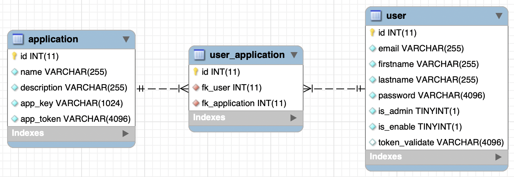
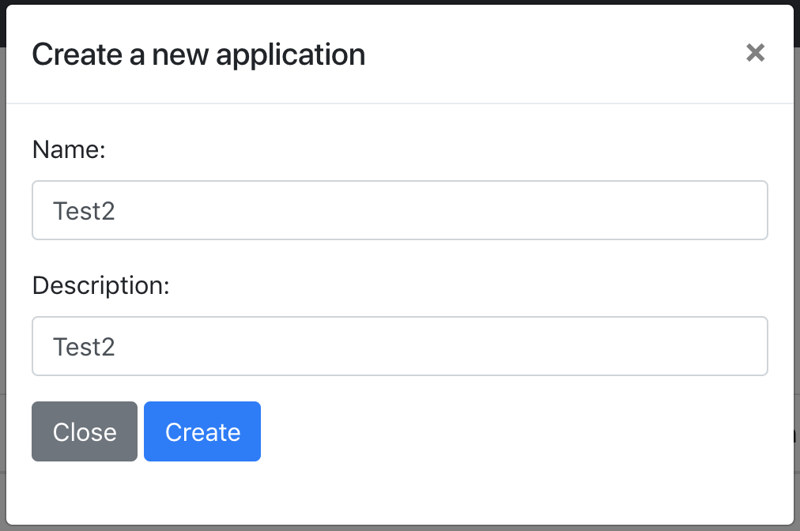
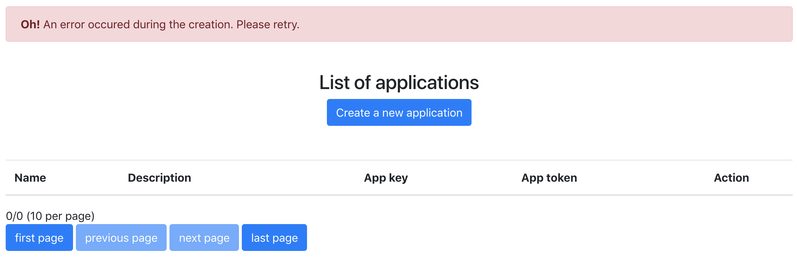

# Teaching-HEIGVD-AMT-2018-Project

## Testing non functional transactions

### Introduction

This document describe our experiment to prove that transactions works in our project. To do that we've tested it on the ApplicationRepository when the application is created.

The creation of an application is done in two steps, the first is to create the application in the table application and after that the link between the application and the user is created on the table user_application. The problem is is the application is created and an exception append before the link is done on the table user_application, our application will be on the database but not linked to any user. 




### Testing rollback

Before we tested it without the ```@TransactionAttribute(TransactionAttributeType.REQUIRES_NEW)``` the result is that the application is created but not the entry in the user_application when we create the application "Test1" :

| Table            | Before                             | After                             |
| ---------------- | ---------------------------------- | --------------------------------- |
| application      |       |       |
| user_application |  |  |

The issue is that the application is created but not linked to any user.


Now to test the rollback, we have added an exception between the application creation and the link request in the table user_application table with the following code : 

```java
@Stateless
@TransactionAttribute(TransactionAttributeType.REQUIRES_NEW)
public class ApplicationRepository {

...
    
	public Application create(Application application, User user) {
        Connection connection = null;
        try {
            // Create the application
            connection = database.getConnection();
            PreparedStatement statement = connection.prepareStatement(
                    "INSERT INTO " +
                            TABLE_NAME +"(name, description, app_key, app_token) " +
                            "VALUES(?, ?, ?, ?)", Statement.RETURN_GENERATED_KEYS
            );
            statement.setString(1, application.getName());
            statement.setString(2, application.getDescription());
            statement.setString(3, application.getAppKey());
            statement.setString(4, application.getAppToken());

            // Associate the application to the user
            if (statement.executeUpdate() == 0) {
                throw new SQLException("Error");
            }

            throw new SQLException("BOOM");

            /*
            ResultSet keys = statement.getGeneratedKeys();

            int count = 0;

            keys.next();
            int key = keys.getInt(1);
            application.setId(key);


            // Create the application
            PreparedStatement statement2 = database.getConnection().prepareStatement(
                    "INSERT INTO user_application (fk_user, fk_application) " +
                            "VALUES(?, ?)"
            );
            statement2.setLong(1, user.getId());
            statement2.setLong(2, application.getId());

            // Associate the application to the user
            if (statement2.executeUpdate() == 0) {
                throw new SQLException("Updates failed");
            }

            return application;*/
        } catch (SQLException e) {
            e.printStackTrace();
            throw new RuntimeException(e);
        } finally {
            try {
                connection.close();
                //return null;
            } catch (SQLException e) {
                e.printStackTrace();
            }
        }  
    }
    
...
    
}
```


And the result is correct, on the client side we have an error and the app creation is rollback correctly. Here some screenshots to show the test : 


App creation : 




Error message on the creation : 




Result in phpmyadmin : 

| Table            | Before                             | After                              |
| ---------------- | ---------------------------------- | ---------------------------------- |
| application      |       |       |
| user_application |  |  |


The result is correct, the new application has been rollbacked.


### Conclusion

First of all we had some issue to understand how transactions works in EJB but with the webcasts and some answers from Liechti Olivier we were able to make it works in our project. 


